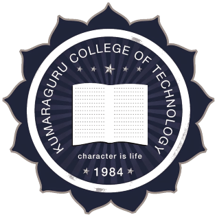

<h4 align="center">- Life Philosophy -</h4>
<h3 align="center">"Every CHAMPION was once a CONTENDER who refused to GIVE UP!"</h3>

 

  
   
   
   
   

---

- 📚 Learning tech in the real world while balancing academics.
- 👨‍🎓 Pursuing MCA From Kumaraguru College of Technology, Tamil Nadu, India
- 🌐 Visit my Website for more about me : [Portfolio](https://gokulan-sk.github.io/MyPortfolio)
- 📫 How to reach me: **Find me on [Gokulan | LinkedIn](https://www.linkedin.com/in/gokulan-s-k)**

 

### Academic Background:

**MCA Graduate**

- In progress ( September 2024 - may 2026)

 

**B.Sc Artificial Intelligence and Machine Learning**

- In progress ( Oct 2021 - May 2024)

---

<picture>
  <source media="(prefers-color-scheme: dark)" srcset="https://raw.githubusercontent.com/gokulan-sk/gokulan-sk/output/github-contribution-grid-snake-dark.svg">
  <source media="(prefers-color-scheme: light)" srcset="https://raw.githubusercontent.com/gokulan-sk/gokulan-sk/output/github-contribution-grid-snake.svg">
  
</picture>

 

---

   

 

Updated on: 04/12/2024
